# 機械学習の基礎

参考: [Deeplearning book](https://www.deeplearningbook.org/)

## 5.1 学習アルゴリズム

学習とは何か？→「**性能指標P**で測定される**タスクT**における性能が**経験E**により改善される場合、そのタスクTのクラスおよび性能指標Pに関して経験Eから学習する」
* タスクT
  * 分類、回帰、転写 etc.
* 性能指標P
  * 精度、誤差率、テスト集合 etc.
* 経験E
  * 教師あり・教師なし

### 経験E

* ほとんどの学習アルゴリズムは**データ集合(データポイント)** を経験することができる
* **教師なし学習**
  * 多くの特徴量をふくむデータ集合から、そのデータ集合構造の有益な特性を学習する
  * 確率ベクトル$\bm{x}$の事例から、確率分布$p(\bm{x})$やその分布の特性を学習する
  * 密度推定、合成、ノイズ除去など
* **教師あり学習**
  * 各事例が**ラベル**と**目標**によって関連づけられている
  * 確率ベクトル$\bm{x}$とそれに関連づけられたベクトル(or数値)$\bm{y}$の事例から、確率分布$p(\bm{y}|\bm{x})$やその分布の特性を学習する

* 教師なしと教師ありには明確な境界線はない
  * どちらのタスクにも対応できる学習技術も多く存在する
  * 半教師あり学習 - 教師用ラベルがついていないものとついているものがある

* **計画行列** - 各行が事象となっている行列
  * 例) Iris datasetでは、150の事例が4つの特徴量を持っている。計画行列は$\bm{X}\in\mathbb{R}^{150\times 4}$である
  * 事象が同じサイズのベクトルで表現できなければならない
    * そうでない場合の処理方法は後述
  * 教師あり学習の場合、ラベルのベクトル$\bm{y}$が必要である

### 例：線形回帰(Linear Regression)
ベクトル$\bm{x}\in\mathbb{R}^n$を入力とし、出力としてスカラー値$y\in\mathbb{R}$を予測する。

$$
\hat y=\bm{w}^\top\bm{x}
$$

* $\hat y$はモデルの予測
* $\bm{w}\in\mathbb{R}^n$は**パラメータ**である
  * パラメータはシステムの動作を制御する
  * $w_i$は$x_i$に掛ける係数で、その後特徴量の寄与度を足し合わせる - $\bm{w}$は**重み**の集合

* $(\bm{X}^{(\text{test})}, \bm{y}^{(\text{test})})$はモデルの評価のためだけに使用する(**テスト集合**)
* **平均二乗誤差**によってモデルの性能を測定する

$$
\begin{aligned}
\text{MSE}_\text{test}&=\frac{1}{m}\sum_i(\hat\bm{y}^{(\text{test})} - \bm{y}^{(\text{test})})^2_i \\
&=\frac{1}{m}||\hat\bm{y}^{(\text{test})} - \bm{y}^{(\text{test})}||^2_2
\end{aligned}
$$

* 訓練集合$(\bm{X}^{(\text{train})}, \bm{y}^{(\text{train})})$観察して$\text{MSE}_\text{test}$を減少させるように$\bm{w}$を改善するアルゴリズムを設計する。
  * 一つの方法は$\text{MSE}_\text{train}$を最小化すること(**正規方程式**)

$$
\begin{aligned}
& \nabla_\bm{w} \text{MSE}_\text{train} = 0 \\
\Rightarrow & \bm{w} = (\bm{X}^{(\text{train})\top}\bm{X}^{(\text{train})})^{-1}\bm{X}^{(\text{train})\top}\bm{y}^{(\text{train})}
\end{aligned}
$$

 

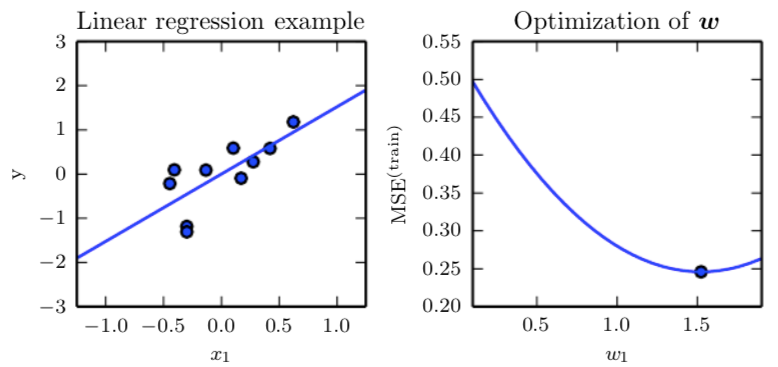

* 線形回帰は、インターセプト項$b$(**バイアス**)というパラメータを追加したものをさすこともある
  * アフィン関数(一次関数)となる

$$
\hat y=\bm{w}^\top\bm{x} + b
$$

## 5.2 容量、過剰適合、過少適合

* **汎化(generalization)** - 過去に観察されなかった入力に対してもうまく機能する能力
* **訓練誤差** - 訓練集合における誤差の指標
* **汎化誤差** - 新しい入力に対する誤差の期待値
* 最適化問題は**訓練誤差**を最小化する。機械学習は**汎化誤差**を最小化する
  * 例) $\text{MSE}_\text{train}$ではなく$\text{MSE}_\text{test}$を最小化したい
* **i.i.d 仮定**
  * 各データ集合の事例が互いに*独立(indipendent)*
  * 訓練集合とテスト集合が*同一の分布に従う(identically distributed)*

* 学習がうまく動作する要素
  * 訓練誤差を小さくする
    * 差が大きい場合**過少適合(未学習、underfitting)**
  * 訓練誤差とテスト誤差の差を小さくする
    * 差が大きい場合**過剰適合(過学習、overfitting)**
* **容量(capacity)** - モデルが多様な関数に適合する能力
  * 容量少 - 過少適合しやすい
  * 容量多 - 過剰適合しやすい
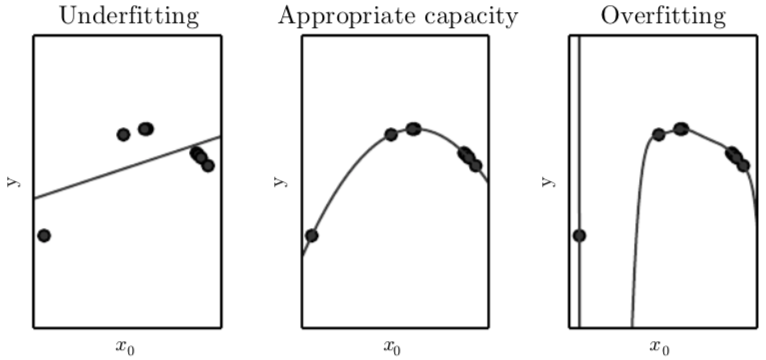

* 訓練対象を減らすために、パラメータを変化させ、アルゴリズムが選択する関数の集合(**表現容量(representational capacity)**)を指定する
  * **仮説空間(hypothesis space)** - 学習アルゴリズムが解として選択できる関数の集合
  * 例) 線形回帰 - 仮説空間は全ての線形関数
  * 例) $\hat y=b+w_1x+w_2x^2$ - 仮説空間は全ての二次関数
  * 例) $\hat y=b+\sum^9_{i=1}w_ix^i$ - 仮説空間は全ての9次関数
* 深層学習モデルの容量を決定するという問題は難しく、使用されることはまずない
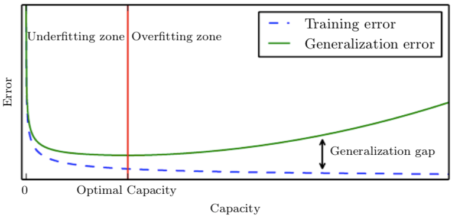

* **ノンパラメトリック**モデル - パラメータについての前提を設けない
  * 例) **最近傍回帰(nearest neighbor regression)** - テスト点$\bm{x}$を分類する場合、訓練集合の中のもっとも近い要素を調べ、関連する回帰目的変数を返す。
$$
\hat y = y_i, \text{ where } i= \mathrm{argmin}||\bm{X}_{i,:} - \bm{x}||^2_2
$$

* *神託(oracle)* - 真の確率分布を知っている存在
  * $\bm{x}$から$y$への写像は、確率的であったり、$\bm{x}$に含まれない変数に影響される可能性があるため、神託であっても誤差が生じる場合がある
  * **ベイズ誤差(Bayes error)** 実際の確率分布から神託が予想した時の誤差

### ノーフリーランチ定理

* 論理的に集合内の全要素を説明する規則を推論するには、集合の全要素に関する情報が必要である
  * 有限の訓練集合からの一般化はこの原則に矛盾しているようである
* 機械学習は、関係する集合の*ほとんどの*要素について*ほぼ*正しい規則の発見を約束する
* **ノーフリーランチ定理** - データを生成する分布全てを平均すると、どの分類アルゴリズムも過去に観測されていない点を分類する際の誤差率は同じになる
  * どの機械学習アルゴリズムも、普遍的に良いと言えるものはない
  * 出現する確率分布の種類に仮定を設けて、その分布に対して良い性能を発揮する学習アルゴリズムを設計できる

### 正則化

* アルゴリズムの挙動は、仮説空間の大きさだけでなく、その関数の独自性にも影響を受ける
  * 例) 線形回帰は、非常に非線形な問題には有用ではない
* どの関数を選択するかで性能を制御できる
  * 例) 線形回帰に**重み減衰(weight decay)** を加える。$L^2$ノルムが小さい重みが優先されるようになる(勾配が小さくなる)。$\lambda$はその優先度である。

$$
J(\bm{w})=\text{MSE}_\text{train}+\lambda\bm{w}^\top\bm{w}
$$
 
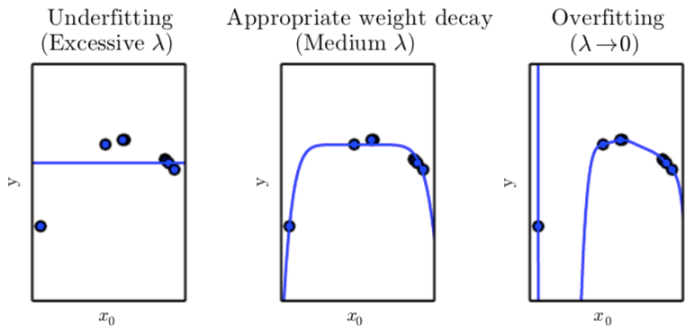

* 一般的には、**正則化項(regularizer)** と呼ばれるペナルティをコスト関数に追加することで**正則化(regularization)** する
  * 例) 重み減衰の正則化項は$\Omega(\bm{w})=\bm{w}^\top\bm{w}$
  * *目的：訓練誤差ではなく、汎化誤差を減少させること*

## 5.3 ハイパーパラメータと検証集合

* **ハイパーパラメータ** - アルゴリズムの挙動を制御するための設定値。*アルゴリズムでは調節されない*
  * 例) 多項式回帰 - 多項式の次数は容量のハイパーパラメータ
  * 例) 重み減衰 - $\lambda$はハイパーパラメータ
* **検証集合** - 訓練アルゴリズムが観察しない、ハイパーパラメータを更新するためのデータ集合
  * テスト集合ではなく訓練集合から構築される

### 交差検証

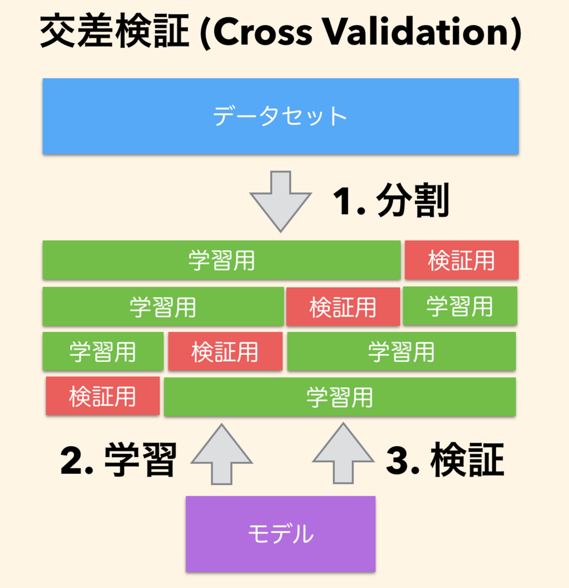
* **交差検証** - 元のデータ集合から無作為に抽出された、部分的になテストセットに対しての訓練とテストの計算を繰り返す。

## 5.4 推定量、バイアス、バリアンス
### 点推定量
* **点推定(point estimator)** - パラメータ$\bm{\theta}$を一つのパラメータ$\hat\bm{\theta}$で推定する。
  * i.i.d仮定を満たすサンプル$\{\bm{x}^{(1)}, \dots \bm{x}^{(m)}\}$の点推定は、

$$
\hat\bm{\theta}_m = g(\bm{x}^{(1)}, \dots \bm{x}^{(m)})
$$

* **関数推定(function estimator)** - 入力$\bm{x}$と出力$\bm{y}$の関係をもっともよく表す$f(\bm{x})$を推定する
  * $\hat f$を関数空間で点推定することと同じ
  * 例) $\bm{y} = f(\bm{x})+\epsilon$である($\epsilon$は$\bm{x}$によらない)と仮定し、$\hat f$を推定する。

### バイアス

* 推定の**バイアス**は以下で定義される

$$
\text{bias}(\hat\bm{\theta}_m)=\mathbb{E}(\hat\bm{\theta}_m) - \bm{\theta}
$$

* $\text{bias}(\hat\bm{\theta}_m)=0$の時*不偏(unbiased)* とする
* $\lim_{m\rightarrow \infin}\text{bias}(\hat\bm{\theta}_m)=0$の時、*漸近普遍(asymptotically unbiased)* という

* 例)

|名前| 分布 | 推定 | $\text{bias}$ |
|---|---|---|---|
|ベルヌーイ分布|$\theta^{x^{(i)}}(1-\theta)^{(1-x^{(i)})}$|$\hat\theta_m=\frac{1}{m}\sum^m_{i=1}x^{(i)}$ | 0|
|ガウス分布|$\frac{1}{\sqrt{2\pi\sigma^2}}\exp(\frac{1}{2}\frac{(x^{(i)}-\mu)^2}{\sigma^2})$|$\hat\mu_m = \frac{1}{m}\sum^m_{i=1}x^{(i)}$| 0 |
|ガウス分布|$\frac{1}{\sqrt{2\pi\sigma^2}}\exp(\frac{1}{2}\frac{(x^{(i)}-\mu)^2}{\sigma^2})$ | $\hat\sigma_m^2 = \frac{1}{m}\sum^m_{i=1}(x^{(i)}-\hat\mu_m)^2$ | $-\frac{\sigma^2}{m}$ |
|ガウス分布|$\frac{1}{\sqrt{2\pi\sigma^2}}\exp(\frac{1}{2}\frac{(x^{(i)}-\mu)^2}{\sigma^2})$ | $\hat\sigma_m^2 = \frac{1}{m-1}\sum^m_{i=1}(x^{(i)}-\hat\mu_m)^2$ | 0 |

### バリアンスと標準誤差

* 推定の**バリアンス** は$\text{Var}(\hat\theta)$、**標準誤差(standard error)** は$\text{SE}(\hat\theta)$と書く
* これらは小さい方が良い

#### 例) ベルヌーイ分布
ベルヌーイ分布

$$
P(x^{(i)};\theta)=\theta^{x^{(i)}}(1-\theta)^{(1-x^{(i)})}
$$

の推定量

$$
\hat\theta_m=\frac{1}{m}\sum^m_{i=1}x^{(i)}
$$

について、

$$
Var(\hat\theta_m) = \frac{1}{m}\theta(1-\theta)
$$

であり、$m$が増加すると推定量の分散も減少することがわかる

### 平均二乗誤差を最小化するためのバイアスとバリアンスのトレードオフ

* バイアスとバリアンスの最小化はトレードオフとなることが多い
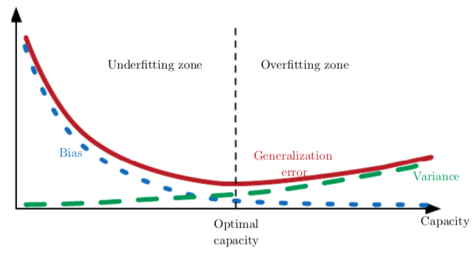
* 解決法
  * 交差検証
  * **平均二乗誤差(mean squared error, MSE)**

$$
\text{MSE} = \mathbb{E}[(\hat\theta_m - \theta)^2] = \text{bias}(\hat\theta_m)^2 + \text{Var}(\hat\theta_m)
$$

### 一致性

* **一致性(弱一致性, consistency)** - 点推定量は$m$が増えると真の値に収束すること
  * $\text{plim}$は確率の収束

$$
\text{plim}_{m\rightarrow\infin}\hat\theta_m = \theta
$$

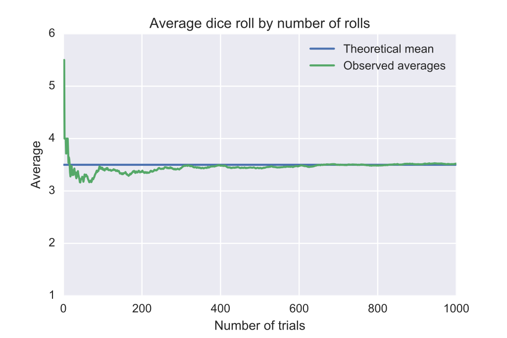

## 5.5 最尤推定

* 未知のデータ分布$p_\text{data}(\bf{x})$からの独立な事例集合$\mathbb{X}=\{\bm{x}^{(1)},\dots,\bm{x}^{(m)}\}$を考える
* $p_\text{model}(\bm{x};\bm{\theta})$が、$p_\text{data}(\bm{x})$を推定するような$p_\text{model}(\bf{x};\bm{\theta})$を考える
* 最尤推定量は次で定義される

$$
\begin{aligned}
\bm{\theta}_\text{ML} &= \argmax_\bm{\theta}\prod^m_{i=1}p_\text{model}(\bm{x}^{(i)};\bm{\theta}) \\
&= \argmax_\bm{\theta}\sum^m_{i=1}\log p_\text{model}(\bm{x}^{(i)};\bm{\theta}) 
\end{aligned}
$$

### 条件付き対数尤度と平均二乗誤差

教師あり学習の場合の確率$P(\bf{y}|\bf{x};\bm{\theta})$の最尤推定量は、全ての入力$\mathbf{X}$と全ての観測$\mathbf{Y}$を用いて次のように表せる
$$
\bm{\theta}_\text{ML} = \argmax_\bm{\theta}P(\mathbf{Y}|\mathbf{X};\bm{\theta})
$$

事例がi.i.dならば、
$$
\bm{\theta}_\text{ML} = \argmax_\bm{\theta}\sum^m_{i=1}\log p_\text{model}(\bm{y}^{(i)}|\bm{x}^{(i)};\bm{\theta})
$$

#### 例) 最尤法としての線形回帰

$p(y|\bm{x})=\mathcal{N}(y;\hat y(\bm{x};\omega),\sigma^2)$と定義すると、この対数尤度は

$$
\sum^m_{i=1}\log p(y^{(i)}|\bm{x}^{(i)};\bm{\theta}) = -m\log\sigma -\frac{m}{2}\log(2\pi)-\sum^m_{i=1}\frac{||\hat y^{(i)}-y^{(i)}||^2}{2\sigma^2}
$$

平均二乗誤差は

$$
\text{MSE}_\text{train}= \frac{1}{m}\sum^m_{i=1}\frac{||\hat y^{(i)}-y^{(i)}||^2}{2\sigma^2}
$$

したがって、対数尤度を最大化する$\bm{w}$と平均二乗誤差を最小化する$\bm{w}$は一致する

### 最尤法の特性

* 以下の条件で一致性をもつ(事例の数が大きくなると、真のパラメータに収束する)
  * $p_\text{data}(\cdot;\bm{\theta})$の中に真の分布$p_\text{data}$が存在する
  * 真の分布$p_\text{data}$は唯一の$\bm{\theta}$に対応する(対応しない場合、真の分布は得られるものの、実際に利用されたパラメータを推定することはできない)

## 5.6 ベイズ統計

|Frequentist statistics|Baysian statistics|
|---|---|
|一つの$\bm{\theta}$を推測してから、その後の予想を立てる| 全ての可能な$\bm{\theta}$から予想を立てる|
|$\bm{\theta}$は固定の値で、確率変数$\hat\bm{\theta}$をデータセットから推測する|データセットは固定の値で、$\bm{\theta}$は確率変数である|

* **事前確率分布(prior probablity distribution)** $p(\bm{\theta})$とは、データを観測する以前に決められる$\bm{\theta}$の分布である
  * $\bm{\theta}$が不確定であることを示すため、エントロピーが高いものを選ぶ
  * 例)$\bm{\theta}$が一様分布、定数関数に近い関数、次数の少ない多項式であるなど

* データセット$\{x^{(1)},\dots,x^{(m)}\}$が与えられた時、ベイズの法則より

$$
p(\bm{\theta}|x^{(1)},\dots,x^{(m)}) = \frac{p(x^{(1)},\dots,x^{(m)}|\bm{\theta})p(\bm{\theta})}{p(x^{(1)},\dots,x^{(m)})}
$$

* $m+1$個目のデータは以下で与えられる

$$
p(x^{(m+1)}|x^{(1)},\dots,x^{(m)})=\int p(x^{(m+1)}|\bm{\theta})p(\bm{\theta}|x^{(1)},\dots,x^{(m)}) d\bm{\theta}
$$

#### 例) ベイズ線形回帰

入力$\bm{x}\in\mathbb{R}^n$と予想する値$y\in\mathbb{R}$は、ベクトル$\bm{w}\in\mathbb{R}$で以下のように表せる

$$
\hat \bm{y} = \bm{w}^\top\bm{x}
$$

サンプル$(\bm{X}^{(\text{train})}, \bm{y}^{(\text{train})})$が与えられる時

$$
\hat \bm{y}^{(\text{train})} = \bm{X}^{(\text{train})}\bm{w}
$$

$\bm{y}^{(\text{train})}$における条件付きガウス分布で表現すると

$$
\begin{aligned}
p(\bm{y}^{(\text{train})}&| \bm{X}^{(\text{train})},\bm{w}) = \mathcal{N}(\bm{y}^{(\text{train})}; \bm{X}^{(\text{train})}\bm{w}, \bm{I}) \\
&\propto \exp\left(-\frac{1}{2}(\bm{y}^{(\text{train})}-\bm{X}^{(\text{train})}\bm{w})^\top(\bm{y}^{(\text{train})}-\bm{X}^{(\text{train})}\bm{w})\right)
\end{aligned}
$$

ガウス分布を$\bm{w}$の事前分布とする

$$
p(\bm{w}) = \mathcal{N}(\bm{w};\bm{\mu},\bm{\Lambda}_0)
\propto \exp\left(-\frac{1}{2}(\bm{w}-\bm{\mu}_0)^\top\bm{\Lambda}^{-1}_0(\bm{w}-\bm{\mu}_0)\right)
$$

**事後分布**は以下である

$$
\begin{aligned}
p(\bm{w}|\bm{X}, y) &\propto p(\bm{y}|\bm{X},\bm{w})p(\bm{w}) \\
&\propto \exp(-\frac{1}{2}(\bm{w}-\bm{\mu}_m)^\top\bm{\Lambda}^{-1}_m(\bm{w}-\bm{\mu}_m))
\end{aligned}
$$

ただし、$\bm{\Lambda}_m=(\bm{X}^\top\bm{X}+\Lambda_0^{-1})^{-1}$であり$\bm{\mu}_m=\bm{\Lambda}_m(\bm{X}^\top\bm{y}+\bm{\Lambda}_0^{-1}\bm{\mu}_0)$である

### 最大事後確率(MAP)推定

* ベイズ推定を利用しながら$\bm{\theta}$を点推定したい
* **最大事後確率(maximum a posteriori, MAP)推定**は以下で与えられる

$$
\bm{\theta}_\text{MAP} = \argmax_\bm{\theta} p(\bm{\theta}|\bm{x}) = \argmax_\bm{\theta} \log p(\bm{x}|\bm{\theta})+\log p(\bm{\theta})
$$

* 事前分布という追加情報によって、バリアンスは減るがバイアスが増える

## 5.7 教師あり学習アルゴリズム

### 確率的教師あり学習

* 線形回帰は以下の分布群に対応している

$$
p(y|\bm{x};\bm{\theta})=\mathcal{N}(y;\bm{\theta}^\top\bm{x},\bm{I})
$$

* 分類へのシナリオへと一般化したい。
* ロジスティックシグモイド関数を使って、線形関数の出力を区間$(0,1)$の間に押し込み、その値を確率とする。これを**ロジスティック回帰**という

$$
p(y=1|\bm{x};\bm{\theta}) = \sigma(\bm{\theta}^\top\bm{x})
$$

### サポートベクトルマシン

* ロジスティック回帰に似ているが、クラス分類のみを出力する
* $\bm{w}^\top\bm{x}+b$が正の時、正のクラスが存在すると予測する
* 次のように書換えれらる

$$
\bm{w}^\top\bm{x}+b = b + \sum^m_{i=1}\alpha_i\bm{x}^\top\bm{x}^{(i)}
$$

* 特徴量関数$\phi(\bm{x})$と、**カーネル** $k(\bm{x},\bm{x}^{(i)})=\phi(\bm{x})\cdot\phi(\bm{x}^{(i)})$を利用して以下のように書き換える(**カーネルトリック**)

$$
f(\bm{x})=b+\sum_i\alpha_ik(\bm{x},\bm{x}^{(i)})
$$

* 利点
  * 非線形なモデルを凸最適化手法を用いて学習できる
  * カーネル関数は内積よりも効率の良いもので定義できることがある

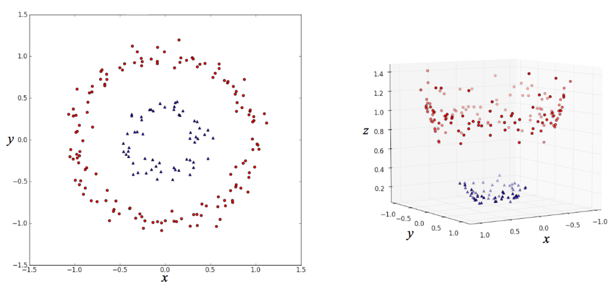

よく使われるカーネルが**ガウスカーネル(動径基底関数, radial basis function, RBF)** である

$$
k(\bm{u},\bm{v}) = \mathcal{N}(\bm{u}-\bm{v};0,\sigma^2\bm{I})
$$

### その他の単純な教師あり学習アルゴリズム

* $k$最近傍回帰
  * クラス分類問題の場合はOne-hotベクトルを利用する
* **決定木(decision tree)**
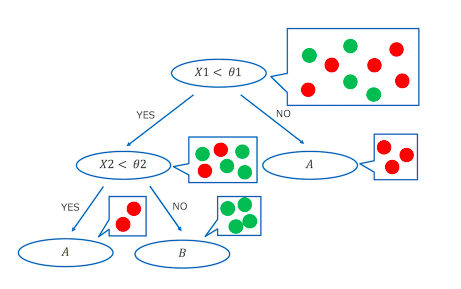

## 5.8 教師なし学習アルゴリズム

### 主成分分析(principal component analysis, PCA)
サンプルの点$\{\bm{x}^{(1)},\dots,\bm{x}^{(m)}\}$を、その正確性を失わせることによって、より少ないメモリーで表現すること

### $k$平均クラスタリング
事例を$k$個の異なるクラスターに分解する。
* それぞれの入力に$k$次元のOne-hotベクトルを割り当てることと等しい
* 初期状態として$k$個の重心$\{\bm{\mu}^{(1)},\dots,\bm{\mu}^{(k)}\}$を設定し、以下の2ステップを繰り返す
  * それぞれの点がもっとも重心が近いクラスに当てられる
  * それぞれのクラスの重心を更新する

## 5.9 確率的勾配下降法(stochastic gradient descent, SGD)

**勾配下降法**(4.3節参照)

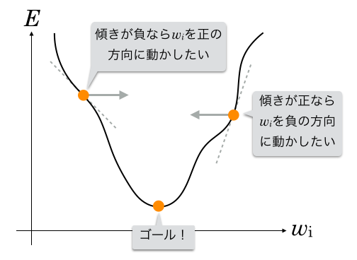

* 勾配の計算コストは、訓練集合の事例が数十億と増加すると極めて長くなってしまう
* 勾配は*期待値*であるので小さなサンプルセットから近似的に推定できる
* **ミニバッチ** $\mathbb{B}=\{\bm{x}^{(1)},\dots,\bm{x}^{(m')}\}$は訓練集合から一様に抽出されるサンプリング。
  * 通常1から数百の少ない事例。
  * $m$が大きくなっても$m'$は変わらない

## 5.10 機械学習アルゴリズムの構築

次を考えれば良い
* データの集合の仕様、コスト関数、最適化手順、モデル

#### 例) 線形回帰アルゴリズム
* データの集合: $\bm{X}$と$\bm{y}$
* モデル: $p_\text{model}(y|\bm{x})=\mathcal{N}(y;\bm{x}^\top\bm{w}+b,1)$
* コスト関数: $J(\bm{w},b)=-\mathbb{E}_{\bm{x},y\sim \hat p_\text{data}}\log p_\text{model}(y|\bm{x})$
  * 正規化項を加える?
* 最適化手順: コスト関数の勾配が0になる点を求める(最尤推定)

## 5.11 深層学習の発展を促す課題

特に、高次のデータ扱う場合に対して起こる問題について取り上げる

### 次元の呪い(curse of dimensionality)

* データの次元が高いと、機械学習が難しくなる。一つの変数に対して存在しうる構成の総数が指数関数的に増加するからである
* 構成の数が膨大であるがゆえに、事例の数より大きくなってしまい、類似した事例を見つけられなくなってしまう

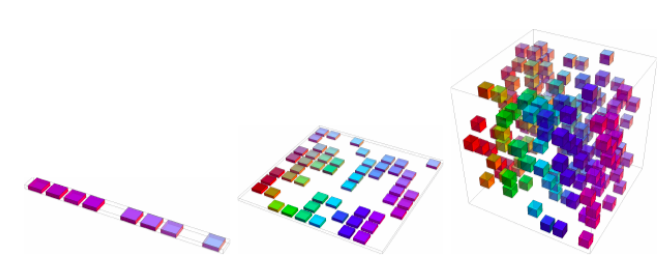

### 局所一様と平滑化

* 事前の信念を事前分布やアルゴリズム選択に反映する
* **平滑化事前分布(局所一様事前分布, smoothness prior)** - 関数が尖りすぎてはいけない
* 平滑化では、人工知能レベルのタスクを解決できない
* 訓練事例の数よりも多くの領域を識別することはできるか？
  * 関数の滑らかさのみではできない
  * 深層学習では、滑らかさに依存しない事前信念を反映させることができることがある

### 多様体学習

* **多様体(manifold)** - ある点の周辺の点がその点に関連づけられている
  * 例）3次元空間のなかの2次元的な「面」は多様体
* **多様体学習** - $\mathbb{R}^n$の多くは無効な点で、ある多様体の上での点のみに興味がある
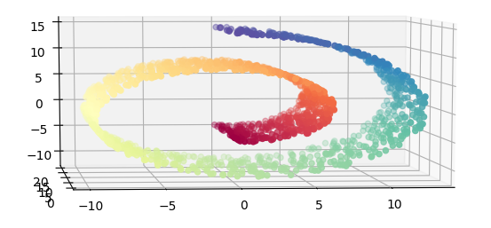
* **多様体仮説** - 現実世界の画像、文字列、音声の確率分布は、局所に集中している
  * ランダムな値の画像が意味をもつ確率は低い
  * 意味をもつサンプルには、それぞれそれと似たようなサンプルがあることが想像できる

